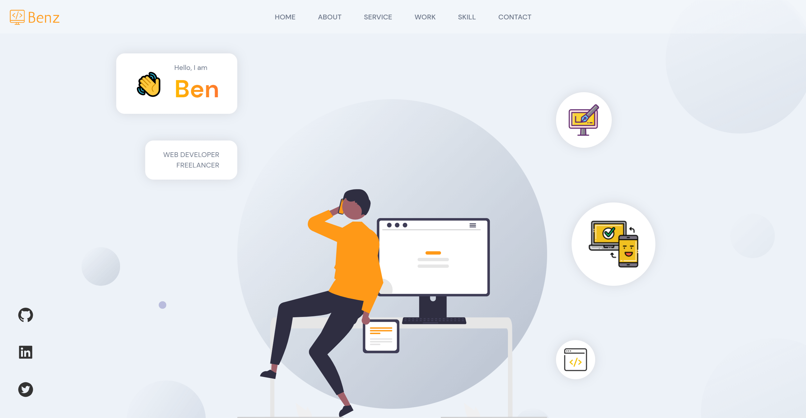
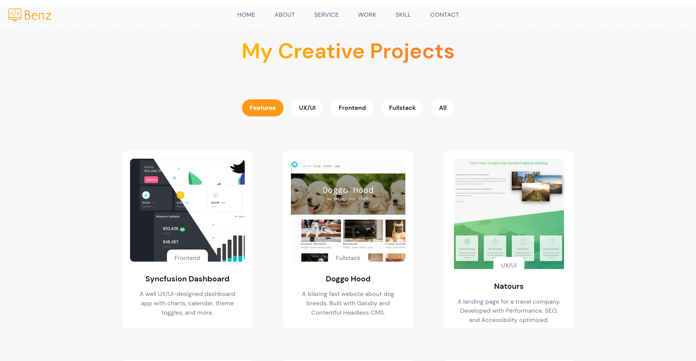
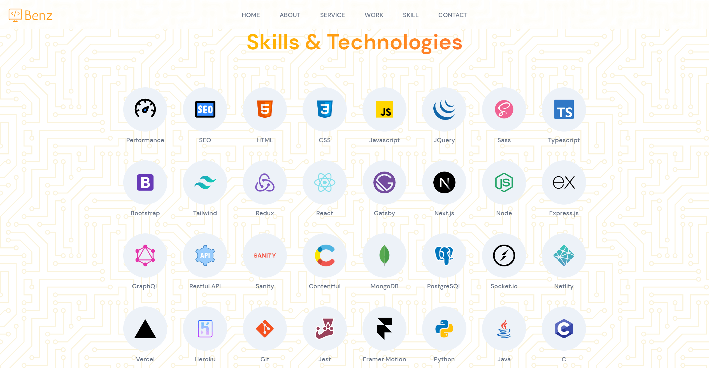
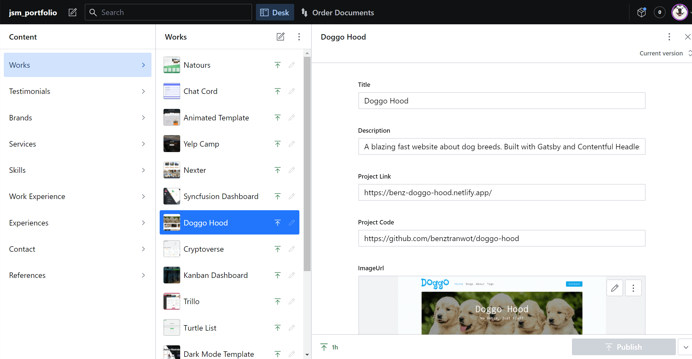

# Jsm Portfolio

[View Live Site](https://benztran.netlify.app/)

My personal portfolio showcases all my skills, projects, and services.

## Preview

&nbsp;
&nbsp;

## Tech stack

- [React](https://reactjs.org/)
- [Sanity](https://www.sanity.io/)
- [Sass](https://sass-lang.com/)
- [Framer Motion](https://www.framer.com/motion/)
- [React Icons](https://react-icons.github.io/react-icons/)
- [Ouch Illustrations](https://icons8.com/illustrations)
- [Hero Patterns](https://heropatterns.com/)
- [unDraw Illustrations](https://undraw.co/illustrations)

## Show your support

Give a ⭐️ if you like this project!
